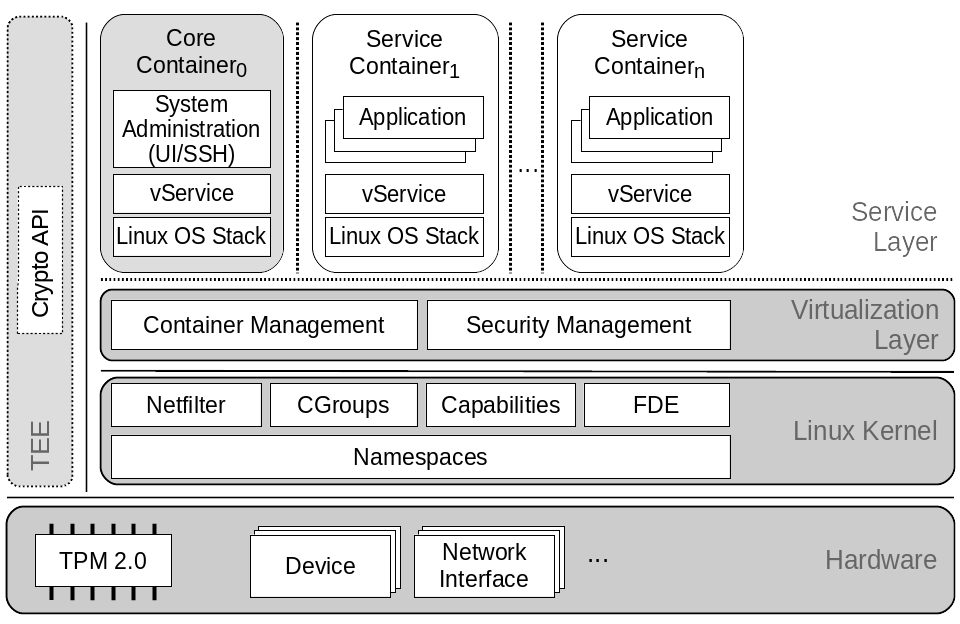

- TOC
{:toc}

trust\|me abbreviates "trusted mobile equipment" and is a
multi-arch OS-level virtualization solution with additional
focus on platform security based on hardware features.
The core component, the virtualization layer, is based on
Linux-specific features like namespaces, cgroups and
capabilities to provide isolation of different Guest
Operating System (GuestOS) stacks on top of a single, shared Linux kernel.
In contrast to other _container_ solutions like Docker,
trust\|me provides a small software stack footprint and additional
separation of privileged instances.
The illustration below shows the system architecture of trust\|me.

User interaction (e.g. admin access through ssh) may not directly end up in the
privileged root namespace. For that purpose a less privileged _core container_
exists, which is already _namespaced_ and may interact
with the privileged virtualization layer through a single specified interface only.
This can be compared to the dom0 approach of Xen.

Furthermore, special platform security features are
directly integrated into the virtualizaion layer in form of services
utilizing a TPM chip and other platform
dependent hardware-based security mechanisms.
In a nutshell, trust\|me offers the following security features and benefits:

### Security features
* Solid container isolation based on modularized OS-level virtualization layer
* Secure boot (e.g. using UEFI on x86)
* Kernel module signing
* Signed GuestOSes (containers)
* Measured boot and remote attestation
* Full disk encryption coupled to TPM and secure boot
* Restriction of superuser in containers with Linux capabilities
* Fine-grained device access with device cgroups whitelists
* (upcoming) Secure Element support for two-factor authentication, e.g., when starting containers
* (upcoming) Relocation of cryptographic keys and ciphers into TEEs (e.g., Kernel Crypto API)

### Benefits
* Maintained, fully open source software stack
* Straightforward build and run of custom containers
* Easy portability to different embedded platforms
* Converter functionality for Docker containers (experimental)
* Flexible remote management via core container (e.g., container deployment, updates, ...)
* PKI support for software signing and device identity

### Getting started
To get started, first [set up the build environment](/setup_host).
After that, you can [build the trust|me base system](/build/build), i.e., kernel, virtualization layer and the core
container. There is also a [quickbuild option](build/quickbuild) and a tutorial how to [create your custom
GuestOSs](/build/guestos). Once trust\|me is built, you might want to [test it on QEMU/KVM](/deploy/qemu)
before deploying it onto your target platform (see Deploy options). We provide an overview on how to [manage
and configure a deployed trust|me system](/operate).
We also provide descriptions on how to securely [roll-out a platform running trust|me](/provisioning) using our proposed [PKI](/pki).

The remainder of this page highlights possible use cases, supported platforms and related scientific publications.
For more information on trust\|me and OS-Level virtualization, [read our background page](/background).

# Use cases

| __Application separation.__ Similar to Docker trust\|me can be used to separate applications in server environments, yet providing a full system inside a container closer to type 1 hypervisors such as Xen. |  |
| __IoT edge devices.__ Its stripped-down version -- just a kernel and a small ramdisk as virtualization layer -- targets embedded systems which can be used in the IoT context for edge devices. trust\|me also provides the reference implementation for the so-called Trusted Connector in the Industrial Data Space. The [Industrial Data Space](http://www.industrialdataspace.org/en/) provides concepts for a generic, shared data cloud for the (industrial) Internet of Things | | 
| __Smartphones.__ Due to its history, formerly designed for Smartphones, it could still run on those devices to provide a container execution environment for background containers. Nevertheless, it is also feasible to separate user containers with different security requirements.| |

# Supported platforms
The trust\|me software stack runs on following hardware platforms:

|Architecture|Device|Secure boot implementation|
|--|--------------------|----------|
| x86 32/64 | Native Intel PC | UEFI Secure Boot |
| x86 32/64 | Qemu | TianoCore (simulated UEFI secure boot and sTPM)|
| ARM 64 | Xilinx Zynq ZCU104 | coming soon (Xilinx and Uboot Verified Boot) |
| ARM 64 | Raspberry Pi3 | coming soon (Uboot Verified Boot) |
| ARM 32 | Raspberry Pi2 | coming soon (Uboot Verified Boot) |
| ARM 32 | Nexus 5/5X | no longer supported (legacy Android build) |

# Publications

|Year|Title|Authors|PDF|
|--|--------------------|----------|--------|
| 2018	| An Ecosystem and IoT Device Architecture for Building Trust in the Industrial Data Space | Gerd Brost, Manuel Huber, Michael Weiß, Mykolai Protsenko, Julian Schütte, Sascha Wessel | [https://doi.org/10.1145/3198458.3198459](https://doi.org/10.1145/3198458.3198459)|
|2017 | Freeze & Crypt: Linux Kernel Support for Main Memory Encryption | Manuel Huber, Julian Horsch, Junaid Ali, Sascha Wessel, | [http://dx.doi.org/10.5220/0006378400170030](http://dx.doi.org/10.5220/0006378400170030) |
| 2015 | A Secure Architecture for Operating System-Level Virtualization on Mobile Devices | Manuel Huber, Julian Horsch, Michael Velten, Michael Weiß, Sascha Wessel | [http://dx.doi.org/10.1007/978-3-319-38898-4_25](http://dx.doi.org/10.1007/978-3-319-38898-4_25) |
| 2015 | Improving mobile device security with operating system-level virtualization (Journal) | Sascha Wessel, Manuel Huber, Frederic Stumpf, Claudia Eckert | [https://doi.org/10.1016/j.cose.2015.02.005](https://doi.org/10.1016/j.cose.2015.02.005) |
| 2013 | Improving Mobile Device Security with Operating System-Level Virtualization | Sascha Wessel, Frederic Stumpf, Ilja Herd, Claudia Eckert | [https://doi.org/10.1007/978-3-642-39218-4_12](https://doi.org/10.1007/978-3-642-39218-4_12) |
