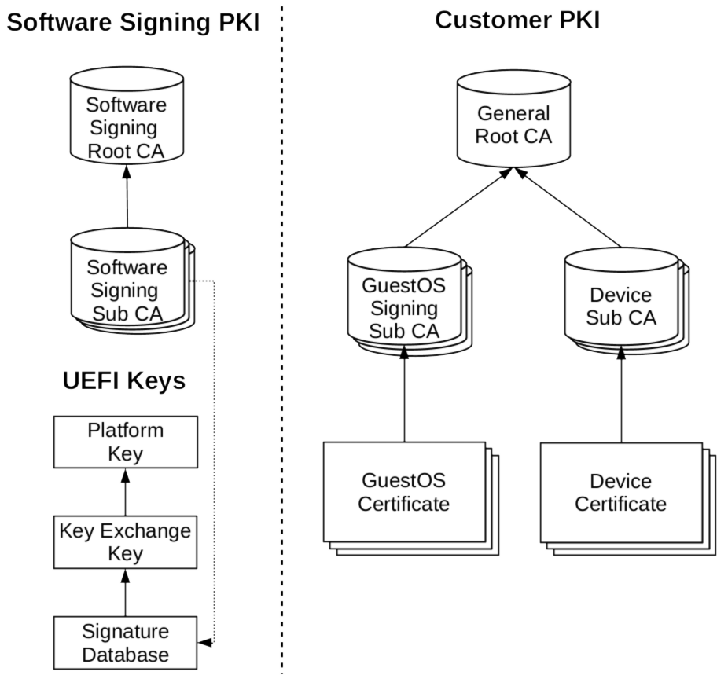

---
---

# PKI


The illustration gives an overview of a possible PKI solution for trust\|me,
which we will describe in more detail soon.
A development PKI instantiation (not intended for productive use) is automatically generated at build time.

### Build development PKI manually from trust\|me source
```
bash ws-yocto/trustme/build/device_provisioning/gen_dev_certs.sh
```

